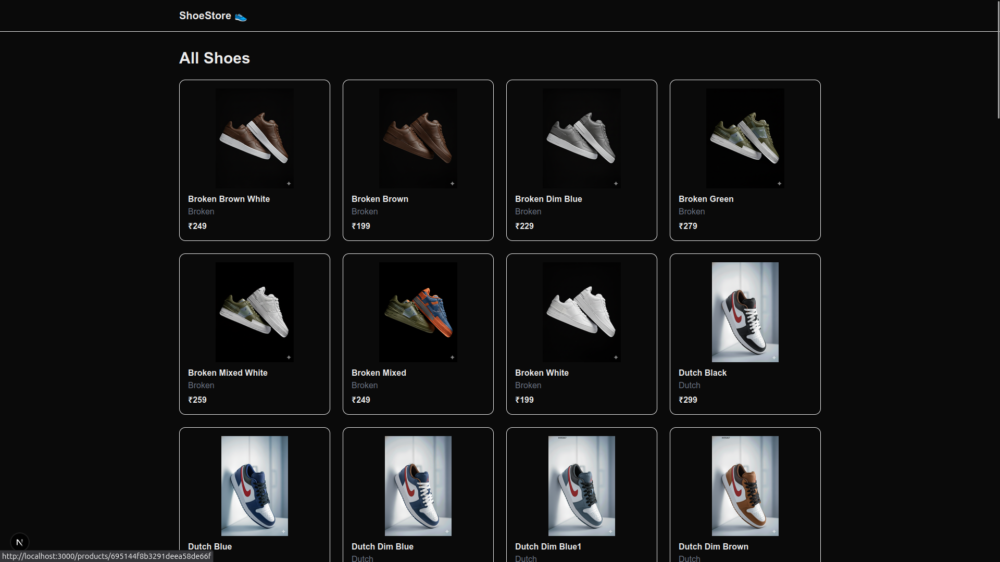

# Shoes E-Commerce Application

A full-stack Shoes E-Commerce application built with Bun + Hono + MongoDB for the backend and Next.js + TypeScript + Tailwind CSS for the frontend.

## image

## 🛠 Tech Stack

Backend

Bun

Hono

MongoDB (Mongoose)

TypeScript

Frontend

Next.js (App Router)

TypeScript

Tailwind CSS

## 📦 Features

Product listing

Product details

Image serving from backend

REST API

Clean modular architecture

## 📁 Project Structure
.
├── backend/
│   ├── src/
│   └── .env
└── frontend/
    ├── app/
    └── .env.local

## ⚙️ Environment Variables
### Backend
PORT=4000
MONGO_URI=your_mongodb_connection_string

### Frontend
NEXT_PUBLIC_API_BASE_URL=http://localhost:4000

## ▶️ Running the Project
### Backend
cd backend
bun install
bun run dev

### Frontend
cd frontend
bun install
bun run dev

## 🌐 URLs

Backend: http://localhost:4000

Frontend: http://localhost:3000

## Author

Aswin